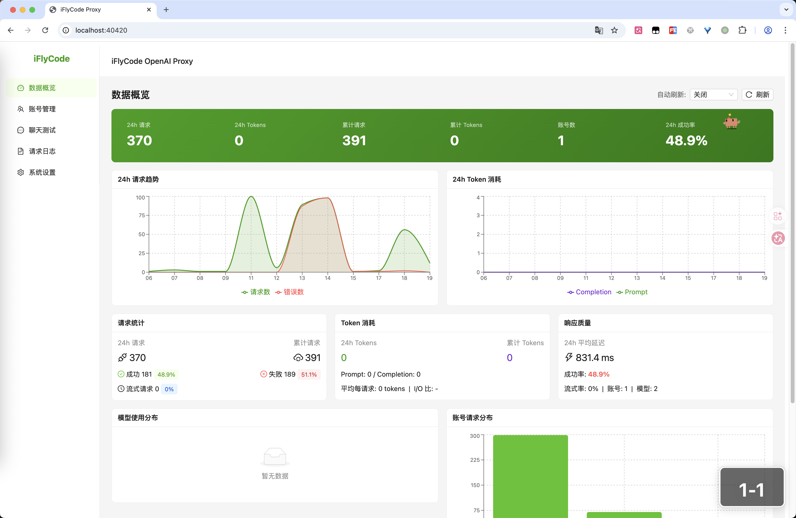
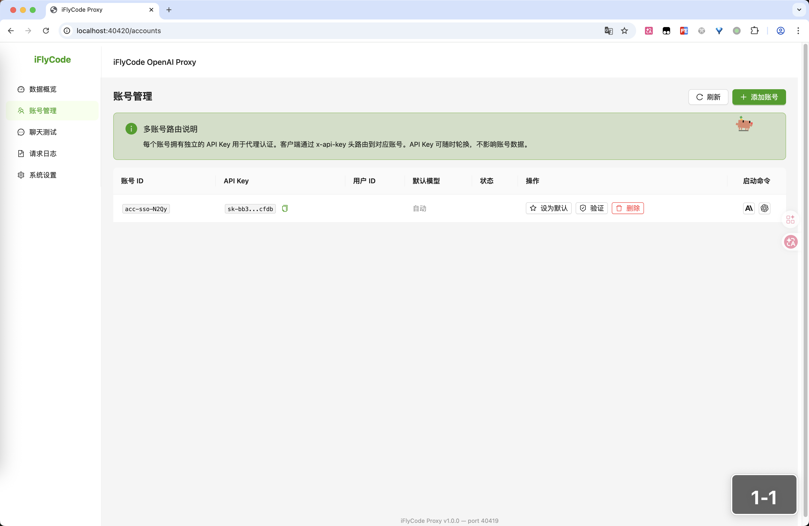
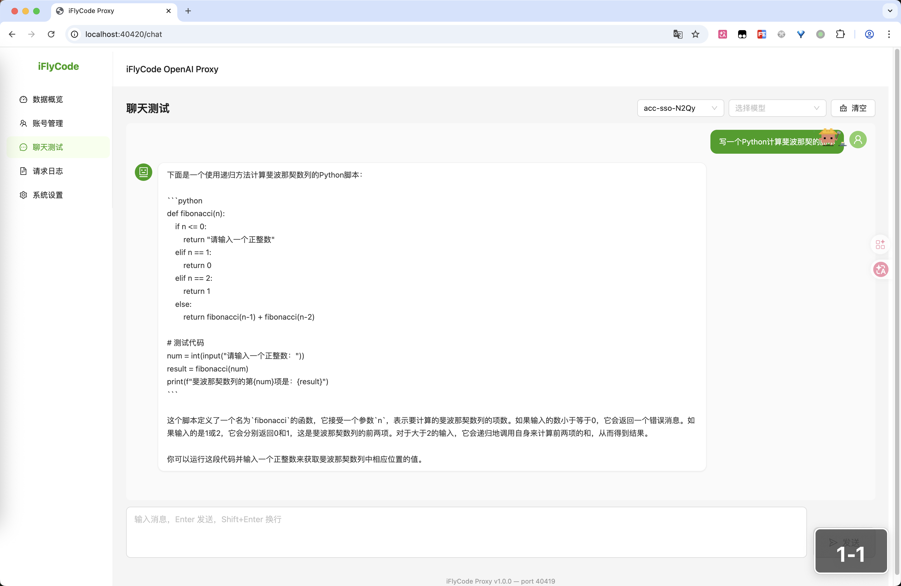
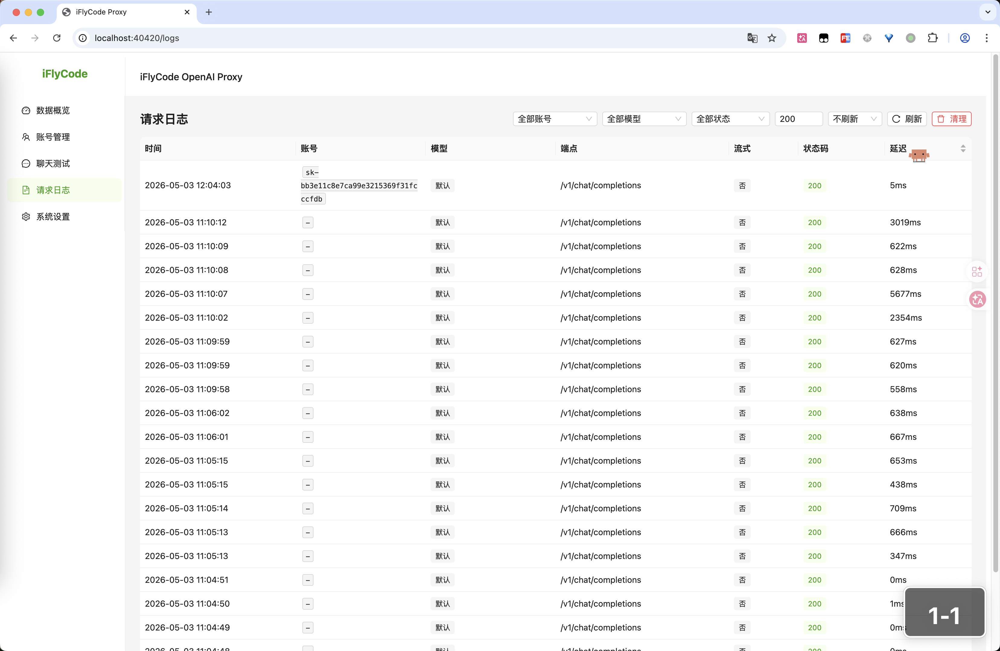
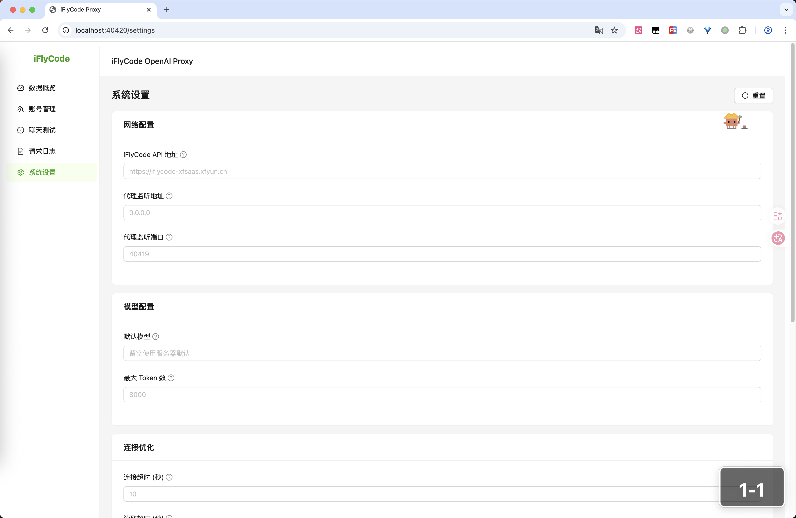

# iFlyCode Proxy

把讯飞星火飞码变成 OpenAI API，这样 Claude Code、Codex 这些工具就能直接用了。

## ⚠️ 当前已知问题 — WAF 阻断

**截止 2026-06-02，所有从该服务器发往 `iflycode-xfsaas.xfyun.cn` 的请求均被 `iflysec Herald` WAF 拦截，返回 502。**

| 测试方式 | 结果 |
|---------|------|
| curl 直连（Content-Type / token header 齐全） | 502 (Herald WAF) |
| Python httpx 客户端（本代理底层 HTTP 库） | 502 (Herald WAF) |
| 绑真实 IP `124.243.239.178` 绕过代理 | 502 (Herald WAF) |
| 走第三方代理/日本节点出去 | 502 (Herald WAF) |
| **官方 Agent 3.4.2 二进制直接启动** | **502 (Herald WAF)** |

**不清楚为什么官方插件在用户电脑上能用而本代理调不通。** 有以下可能性（未验证）：
- 官方 Agent 通过内网/专线访问，不走公网 WAF
- WAF 放行了特定网络环境（如企业办公网），本服务器不在白名单内
- API 有一定程度的请求指纹校验（header、TLS handshake 等），本代理没有完全伪造一致

以上可能性均为猜测，未在干净的普通网络环境下验证过。

**如果你有一台直连公网（无 Clash/VPN/Docker 等网络干涉）的机器，部署后从本地浏览器 SSO 登录，试试能不能通。如果能通请提 Issue 告知环境。**

---

## 一分钟上手

```bash
pip install -e .
iflycode-proxy serve
```

打开 http://localhost:40419 添加你的讯飞 SSO 账号，搞定。

## 怎么用

**Claude Code：**

```bash
ANTHROPIC_BASE_URL=http://localhost:40419 \
ANTHROPIC_AUTH_TOKEN="你的Key" \
claude --dangerously-skip-permissions
```

**Codex：**

```bash
OPENAI_API_KEY="你的Key" OPENAI_BASE_URL=http://localhost:40419/v1 codex
```

**Python：**

```python
from openai import OpenAI
client = OpenAI(api_key="你的Key", base_url="http://localhost:40419/v1")
print(client.chat.completions.create(
    model="iflycode-default",
    messages=[{"role": "user", "content": "写个快排"}],
).choices[0].message.content)
```

## 能干啥

- 兼容 OpenAI 和 Anthropic 两种 API 格式，流式非流式都行
- 多账号池，自动轮换，不用操心限流
- Chat 和 Coding 两种模式，Coding 模式支持工具调用
- 自带管理面板，看统计、查日志、管账号
- 可以跑守护进程，崩了自动重启

## 模型

| ID | 啥是啥 |
|----|--------|
| `iflycode-default` | 普通聊天 |
| `iflycode-default-coding` | 写代码，支持 tool_use |
| `4.0Ultra` | 星火 4.0 Ultra |
| `pro-128k` | 星火 Pro 128K 长上下文 |
| `generalv3` | 星火 Pro |
| `lite` | 星火 Lite，免费的 |

> 星火飞码本身是编程助手，问它"今天天气怎么样"会被拒绝，问代码相关的问题没问题。

## 面板长这样








## CLI

```bash
iflycode-proxy serve [-p 端口] [--service]   # 启动，--service 跑后台
iflycode-proxy stop-service                   # 停后台
iflycode-proxy service-status                 # 看状态
```

## 技术栈

Python + FastAPI 后端，React + Ant Design 前端，SQLite 存数据。没什么花活。

## 相关项目

- [iflycode-RE](https://github.com/vibe-coding-labs/iflycode-RE) — 星火飞码插件的逆向分析，这个 proxy 就是基于它搞出来的

## License

MIT
